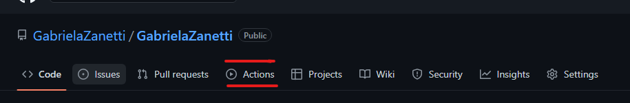
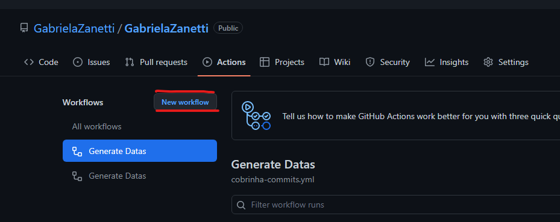
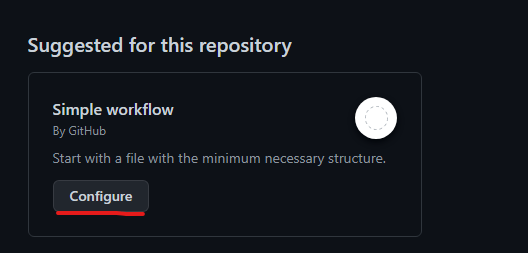
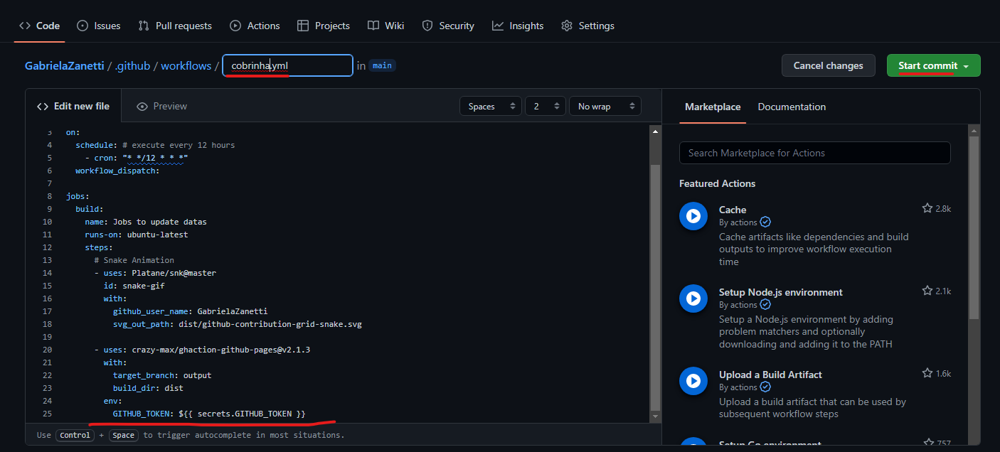
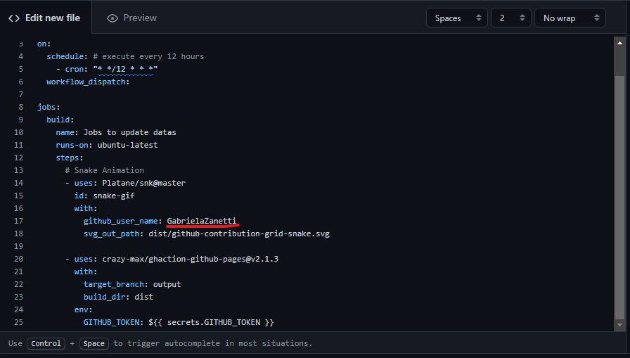
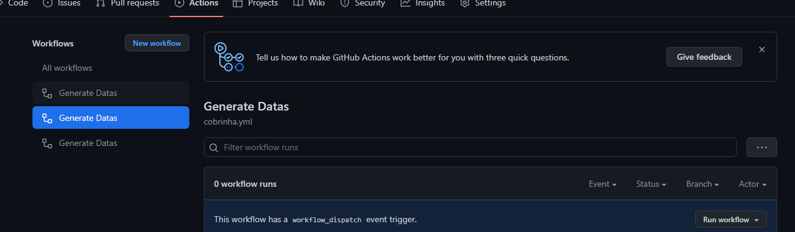
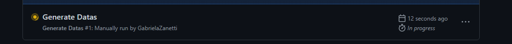
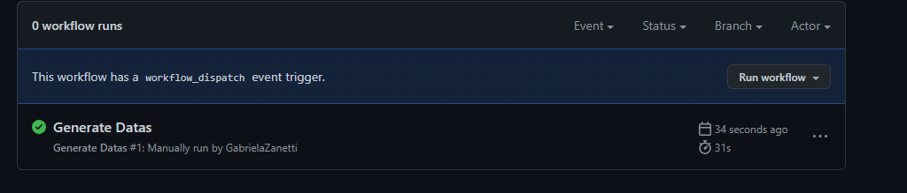

# Animação Cobrinha
esse é o passo a passo de como fazer a animação da cobrinha que come os commits.
 

Iniciamos no repositorio do perfil, em Actions

 

Criamos um Workflows

 

Após criar selecionamos o Simple workflow, onde configuramos ele para carregar a animação da cobrinha.

 

Logo em seguida escolhemos o nome e adicionamos o código

 

name: Generate Datas

 

on:

   schedule: # execute every 12 hours

     - cron: "* */12 * * *"

   workflow_dispatch:

jobs:

   build:

     name: Jobs to update datas

     runs-on: ubuntu-latest

     steps:

       # Snake Animation

       - uses: Platane/snk@master

         id: snake-gif

         with:

         github_user_name: GabrielaZanetti

         svg_out_path: dist/github-contribution-grid-snake.svg

 

       - uses: crazy-max/ghaction-github-pages@v2.1.3

       with:

         target_branch: output

         build_dir: dist

       env:

       GITHUB_TOKEN: ${{ secrets.GITHUB_TOKEN }}

 

No código adicionamos exclusivamente o username do GitHub

 

Em seguida clique em start commit e commita o arquivo para adicionar o arquivo no main

Selecione novamente o Actions e em Generate Datas estara selecionado o arquivo da cobrinha.yml

 

Cloque em run woekflow e aguarde o carregamento.

 

E por fim adicione no readme a seguinte linha de código:

 

 

Apenas mudando seu username.

