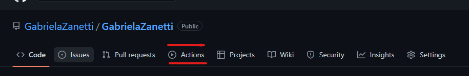
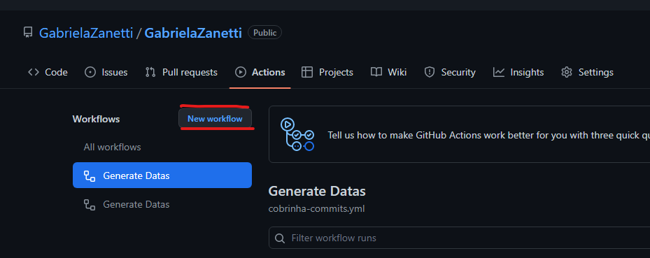
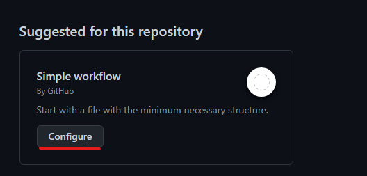
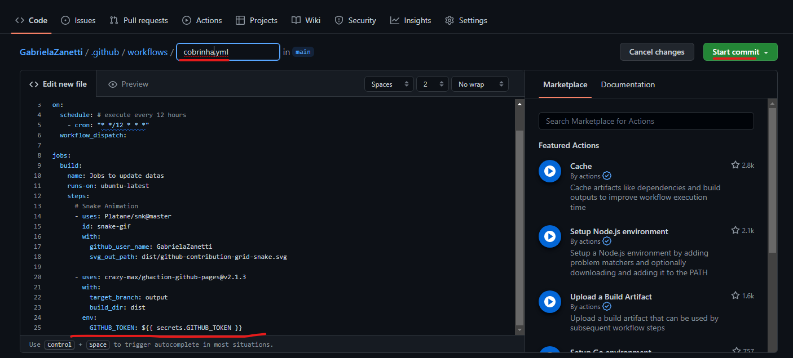
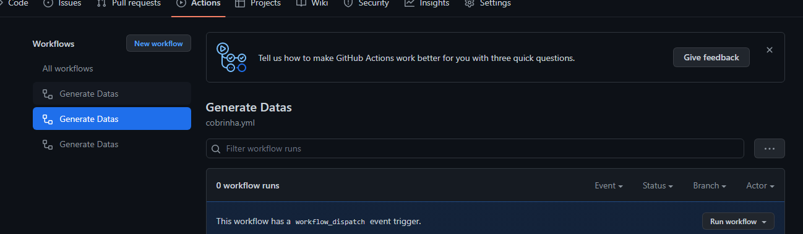
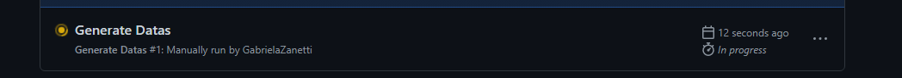
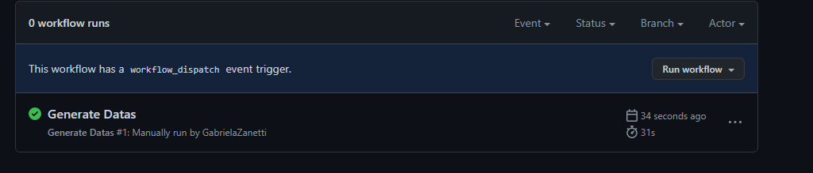

# Animação de Contribuições (Cobrinha)

Guia atualizado para configurar a animação da cobrinha que consome seus commits no gráfico de contribuições do GitHub.

## 1. Acessar o repositório do perfil

Abra o repositório do seu perfil no GitHub e acesse a aba **Actions**.



## 2. Criar um workflow

Selecione a opção para criar um novo workflow.



## 3. Escolher o template

Escolha o template **Simple workflow** para iniciar a configuração.



## 4. Configurar o workflow

Defina um nome para o workflow e adicione o seguinte código:

```
name: generate snake animation

on:
  schedule:
    - cron: "0 0 * * *"

  workflow_dispatch:

  push:
    branches:
      - main

jobs:
  generate:
    permissions:
      contents: write
    runs-on: ubuntu-latest
    timeout-minutes: 5

    steps:
      - name: generate snake animation
        uses: Platane/snk/svg-only@v3
        with:
          github_user_name: ${{ github.repository_owner }}
          outputs: |
            dist/snake.svg
            dist/snake-dark.svg?palette=github-dark

      - name: publish files
        uses: crazy-max/ghaction-github-pages@v3.1.0
        with:
          target_branch: output
          build_dir: dist
        env:
          GITHUB_TOKEN: ${{ secrets.GITHUB_TOKEN }}
```



## 5. Salvar e executar

Finalize criando o commit diretamente na branch **main**.

Em seguida, volte para a aba **Actions**, selecione o workflow criado e execute manualmente a ação.





## 6. Adicionar ao README

Inclua o código abaixo no seu README, substituindo pelo seu nome de usuário:

```
<picture>
  <source media="(prefers-color-scheme: dark)" srcset="https://raw.githubusercontent.com/SEU-USUARIO/SEU-USUARIO/output/snake-dark.svg">
  <source media="(prefers-color-scheme: light)" srcset="https://raw.githubusercontent.com/SEU-USUARIO/SEU-USUARIO/output/snake.svg">
  
</picture>
```

## Exemplo

<picture>
  <source media="(prefers-color-scheme: dark)" srcset="https://raw.githubusercontent.com/GabrielaZanetti/GabrielaZanetti/output/github-contribution-grid-snake-dark.svg">
  <source media="(prefers-color-scheme: light)" srcset="https://raw.githubusercontent.com/GabrielaZanetti/GabrielaZanetti/output/github-contribution-grid-snake.svg">
  
</picture>
